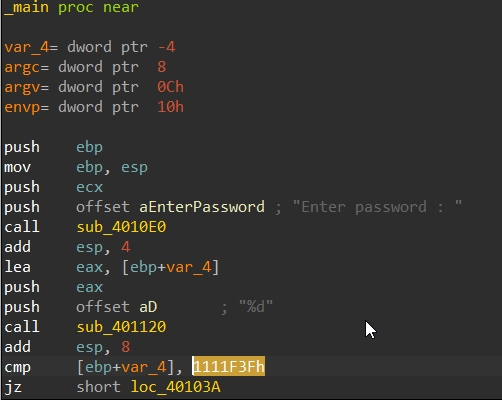
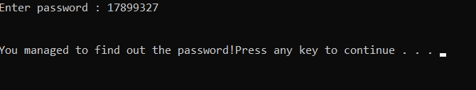

## Introduction
Upon initial analysis of the program in IDA we find that there is a cmp(compare) in main of the program which sets the flag for the answer check.

Here the input from the user is contained within **[ebp+var4]** and it is compared to **1111F3Fh** *(which is in hexadecimal)*, if the compare returns true then it jumps to the correct response or else it gives an error.

1111F3F(hex) = 17899327 (decimal)

If we try entering the number **17899327**, it shows us that it is the correct answer !

Link to the problem if you want to try it yourself ! - > https://crackmes.one/crackme/61cf14fe33c5d413767ca20f
